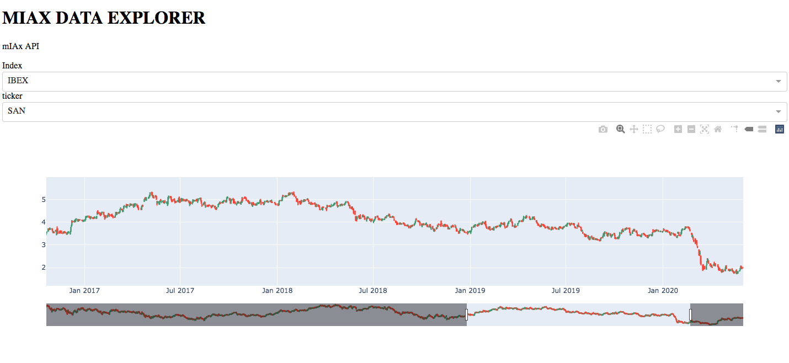

# Aplicación Dash Final

---

- Vamos a realizar una aplicación que nos muestre los datos del API de la práctica de algoritmos.
- De forma iterativa mejoraremos la aplicación.

---
# Paso 1
- Mostramos los datos de cierre en una gráfica de línea del Santander.

---
# Paso 2
- Añadimos títulos y Subtítulos.

---
# Paso 3
- Generamos dos dropdown menús para el índice y para los tickers.
- Al cambiar el índice se tiene tiene que actualizar el gráfico.

---
# Paso 4
- Cambiamos el gráfico de linea por un gráfico de velas.

---
# Paso 5 (opcional)
- Mejora  el aspecto usando un fichero css a tu gusto.
- Por ejemplo:

