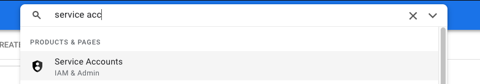
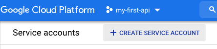
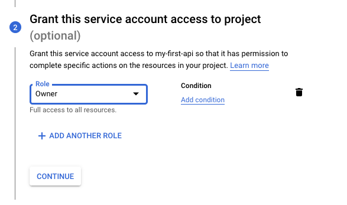
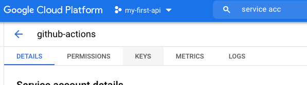
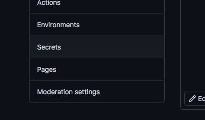
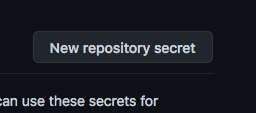
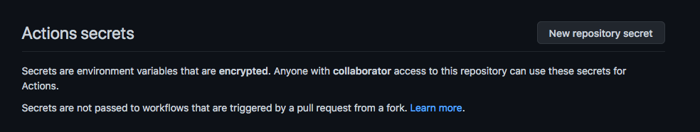
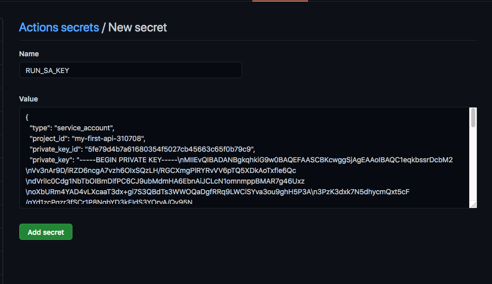
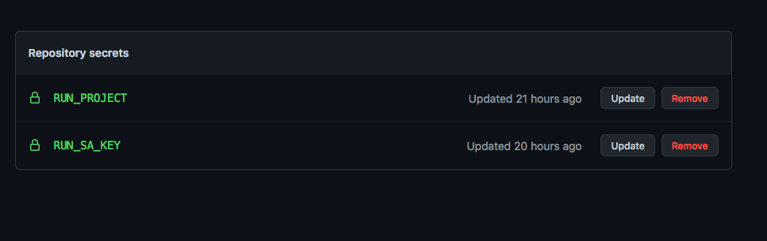
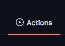

# Introducción a los desplieges automáticos con GitHub Actions

<style>
img[alt~="center"] {
  display: block;
  margin: 0 auto;
}
</style>

---

- Vamos a automatizar el despliege del API.
- Para ello usaremos GitHub Actions, Google Cloud Build y Cloud Run.
- GitHub Actions provisiona una máquina en la que podemos ejecutar una serie de acciones cuando ocurre algún evente en nuestro repositorio.
- En nuestro claso desplegaremos una nueva versión cuando hagamos un push a main.

---


---
- Definimos el proceso de despliege en una fichero YAML:

```yaml
name: Build and Deploy to Cloud Run

on:
  push:
    branches:
    - main

env:
  PROJECT_ID: ${{ secrets.RUN_PROJECT }}
  RUN_REGION: europe-west1
  SERVICE_NAME: api-cloud-run

jobs:
  setup-build-deploy:
    name: Setup, Build, and Deploy to Cloud Run
    runs-on: ubuntu-latest

    steps:
    - name: Checkout
      uses: actions/checkout@v2

    # Setup gcloud CLI
    - uses: GoogleCloudPlatform/github-actions/setup-gcloud@master
      with:
        version: '290.0.1'
        service_account_key: ${{ secrets.RUN_SA_KEY }}
        project_id: ${{ secrets.RUN_PROJECT }}

    # Build and push image to Google Container Registry
    - name: Build
      run: |-
        gcloud builds submit \
          --quiet \
          --tag "gcr.io/$PROJECT_ID/$SERVICE_NAME:$GITHUB_SHA"

    # Deploy image to Cloud Run
    - name: Deploy
      run: |-
        gcloud run deploy "$SERVICE_NAME" \
          --quiet \
          --region "$RUN_REGION" \
          --image "gcr.io/$PROJECT_ID/$SERVICE_NAME:$GITHUB_SHA" \
          --platform "managed" \
          --allow-unauthenticated
```
- Este fichero tiene que estar en la carpeta .github/workflows.

---

- El proceso necesita dos variables de entorno:
    - RUN_PROJECT: Nombre del proyecto donde vamos a desplegar nuestra aplicación.
    - RUN_SA_KEY: Key de un service account con los siguientes permisos:
        - Service Account User
        - Cloud Build Editor
        - Cloud Run Admin
        - Viewer

---
# Ejemplo
- Primero generamos el service account con los permisos necesarios.





---


---

- Podemos poner el permiso de owner aunque no es lo correcto.



---


---
- Generamos el json con la key del service account.


---


---


---
- Añadimos las variables a GitHub.




---



---


---


---
- Añadimos el fichero al repositorio.
- Si todo está correcto al hacer el push la aplicación se deplegará automáticamente.
- Podemos verlo en el menú de github actions.

---


---
- Si entramos en el registy veremos que hay una nueva imagen.


---

- Tendremos una nueva revisión en nuestro servico de cloud run.


---
# Ejercicio
- Configura el despliege automático para tu dash.

