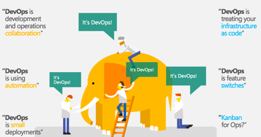
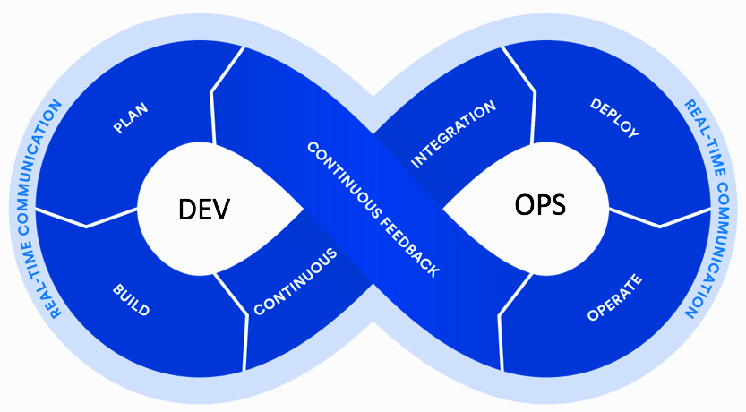
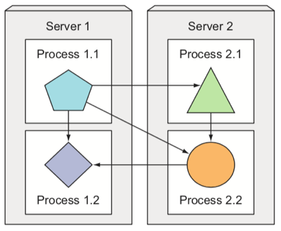

# Introducción a DevOps.

---

# DevOps
- Todo necesita software hoy en día
- El software tiene que ser ejecutado en un servidor para convertirse en un servicio
- Puntos de fricción en la organización que hacen que sea propenso a errores
- IT es frecuentemente el cuello de botella

---
# Síntomas
- Defectos son desplegados en producción causando problemas
- Inhabilidad para diagnosticar problemas en producción de forma rápida
- Los problemas aparecen en algunos entornos
- Culpas entre empleados
- Retrasos esperando a dev, QA o otros equipos
- Errores manuales

---
# Wall of confusion

---
# DevOps

- Unificar el desarrollo de software (Dev) y la operación del software (Ops).
- Defender enérgicamente la automatización y el monitoreo en todos los pasos de la construcción del software: 
    - integración 
    - pruebas
    - liberación 
    - implementación 
    - administración de la infraestructura

---
# DevOps

- Dando lugar a:
    - ciclos de desarrollo más cortos
    - mayor frecuencia de implementación
    - lanzamientos más confiables
    - alineación con los objetivos comerciales

---

---

# CICD
- Integración del código en un repo compartido frecuentemente, al menos una vez al día
- Tests automatizados
- Builds automatizadas
- Detección de errores rápida
- Despliegue en producción automática

---
# CICD

---
# CICD

---
# Monolito

---
# Microservicios

---
# Herramientas

---
# Workflow

